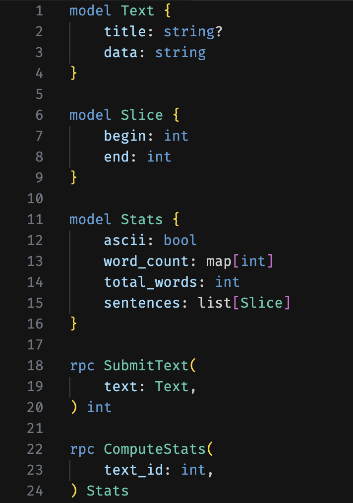

# rRPC vscode Extension

This extension adds basic language support for rRPC schema files (`.rrpc`) in Visual Studio Code.

## Features
- Syntax highlighting for rRPC keywords (`model`, `rpc`), type keywords (`list`, `map`),
  builtins (`string`, `int`, `bool`, `json`, `raw`), comments, and punctuation.
- Language configuration for brackets and line comments.

## Requirements
None.

## Extension Settings
None.

## Release Notes
### 0.0.1
- Initial release with basic highlighting for `.rrpc` files.
